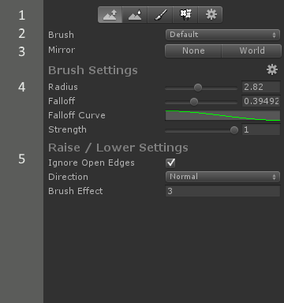

# Polybrush Documentation

## Quick Start

1. Open `Tools > Polybrush > Open Vertex Sculpting Tool`

2. Select the **Raise / Lower** Mode (far left icon in top toolbar)

3. Select a mesh, then left click and drag

4. Experiment with the other modes!

## The Interface

| | Name | Description |

|-|-| |

| 1 | Mode Toolbar | Selects the current brush mode.  See also [Brush Modes](#modes). |

| 2 | Brush Selector | Select the brush preset to use, or add a new preset. |

| 3 | Brush Mirroring | The mirroring to apply to the current brush.  See also [Mirror Modes](#mirror-modes). |

| 4 | Brush Settings | The current brush settings. See also [Brush Settings](#brush-settings). |

| 5 | Mode Settings | Settings specific to the current mode. |

## Modes

**Modes** define how a brush interacts with a mesh.  Some move vertices around, others apply values per-vertex (like color).

> **Shift + Q** cycles between brush modes.

### Raise / Lower

The **Raise / Lower** tool moves vertices in positive and negative directions along an axis (determined by the **Direction** setting).

**Direction** determines how vertices move.  **Up**, **Down**, and **Forward** move vertices along the X, Y, and Z axes respectively.  **Normal** moves vertices along their normals.  Use **Normal** on objects like spheres where you want the movement to be relative to the direction of the affected vertices.

Holding the *Shift* key while dragging the *Left Mouse Button* will inverse the movement direction (Up becomes Down, Right becomes left, etc).

### Smooth

The **Smooth** tool averages the differences between vertex positions along a axis (set by **Direction**).  Use this mode to make your jagged vertices more uniform.

**Relax** is an option available when the **Direction** setting is **Normal**.  This means Polybrush will smooth vertices on all axes instead of just one.  This has the effect of making faces look more even but can also shrink the mesh size.

### Color Paint

**Paint** mode enables you to set the vertex colors of a mesh with a brush or paint bucket.  Use the toolbar under *Paint Settings* to choose between the two modes.

**Brush Color** shows the current brush color.  Note that the final color the brush applies also depends on the **Brush Strength** and the underlying mesh color.

To select a new brush color, either click an element in the **Color Palette** list or manually change the **Brush Color** field.

The **Color Palette** provides quick access to brush colors.  You can add, remove, or change colors in this list at any time.  To reset a palette back to the default values, click *Set Defaults* below the list view.

To add a new **Color Palette** open the **Palettes** popup and select *Add Palette...*.

### Texture Paint

**Texture Painting** mode is a special interface for texture blending shaders.  It applies data to a mesh using a combination of some or all of the following attributes: `[ UV0, UV2, UV3, UV3, Color, Tangent ]`.  This information is usually defined by the shader (see [Writing Texture Blend Shaders for Polybrush](Documentation/texture_blend_shaders.html)), but can optionally be overriden in the settings interface.  **Polybrush** includes a 12 texture blend shader to get you started (use *Standard Texture Blend* material).

If you'd like to write your own texture blending shaders, see the [Writing Texture Blending Shaders for Polybrush](Documentation/texture_blend_shaders.html) document for more information on how this works.

### Settings

Settings provides access to some options that apply to all modes.  Usually you won't need to change these, but if you have specific needs it may be necessary.

- **Rebuild Normals** - When modifying the mesh vertex positions the normals may become inaccurate.  When **Rebuild Normals** is on Polybrush will automatically rebuild the mesh normals as necessary.

- **Hide Wireframe** – When enabled meshes that a brush is hovering will not render the selection wireframe.  This makes it easier to see color and texture changes.

- **Anchor Brush Settings** - Some modes may have settings that extend beyond the current Polybrush window, causing a scrollbar to appear.  If **Anchor Brush Settings** is on the **Brush Settings** will always be visible at the top of the window, regardless of scroll position.

- **Brush Handle Color** - This defines the color of the brush preview at the center.  Vertices that will be 100% affected by a brush are shown with this color.

- **Brush Gradient** - Vertices that are less than 100% affected by a brush will be shown with a color evaluated by this gradient with the applied strength.

* * *

## Mirror Modes

Polybrush can mirror all your brush strokes as you're working.  Mirroring is per-axis (X, Y, Z) and can either be calculated in **World** or **Camera** space.

When mirroring in **World** coordinates the mirrored brush position is calculated by flipping the camera to point of impact ray along the axis relative to the hit object's transform.  **Camera** flips the ray relative to the scene camera transform.

When using **Camera** relative coordinates it is best to keep the target mesh in the center of the Scene View (**F** frames the current selection in the center of the view).

* * *

## Brush Settings

**Brush Settings** are stored as assets in your project, so you may have as many brush presets as you'd like.  To add a new preset, open the Brush popup and select "Add new."  Clicking on the "Brush" field will ping the current preset in the Project window.

##### Brush Settings Fields

- **Radius** - The radius of the brush's sphere of influence.  Corresponds with the outer ring of the brush gizmo in the scene view.  Vertices outside this ring will not be affected by a brush stroke.

- **Falloff** - The distance from origin to radius at which the maximum strength of a brush begins to diminish.  For example, a brush with a **Radius** of 1 and **Falloff** of .25 means that the any vertices inside the falloff distance will be affected with the full strength, while vertices between .25  and 1 will receive a modified strength of between maximum strength and 0.

- **Falloff Curve** - This defines how vertices outside the falloff will have their strength evaluated.

- **Strength** - The amount of power with which to apply this brush stroke.  The **Raise / Lower** tool will use this value to determine how far a vertex should move, while **Smooth** and **Paint** modes will treat this value as normalized between 0 and 1 (no effect and full effect).

The **Radius** and **Strength** settings provide options to adjust the minimum and maximum values per-**Brush Settings** asset.  Click the "gear" gizmo to the right of the *Brush Settings* header to open these settings.

| Shortcut | Description |

|-|-|

| `Control + Mouse Wheel` | Adjust brush radius |

| `Shift + Mouse Wheel` | Adjust falloff |

| `Control + Shift + Mouse Wheel` | Adjust strength |

# Misc

## Save Mesh as Asset

Polybrush adds a new button to `MeshFilter` components that reference an instanced mesh (a mesh that isn't saved in the project).  The "Save to Asset" button will create a new mesh asset in your project and point the `MeshFilter` to that object.  This allows the mesh to be used in Prefabs.

# Troubleshooting

### Can't See Vertex Colors / Textures

Make sure the shader on the mesh that you're working with supports vertex colors or texture blending.  **Polybrush** includes the shaders `z_StandardVertexColor.shader` and `z_TextureBlend_Unity53.shader` which support colors and texture blending respectively.

### Prefabs aren't working

See [Save Mesh as Asset](#save-mesh-as-asset).

